# Jacked_In_VR_Minecraft_Sword_Starter_Code

🗡️ Building a Custom Sword in Minecraft using Java

Hello! Today you'll be learning how to make your very own custom sword in Minecraft using Java programming. Along the way, we’ll learn some important coding concepts.

Let’s get started! 🚀

1️⃣ Open the Project

First, open the project in your preferred editor. This tutorial uses VS Code.

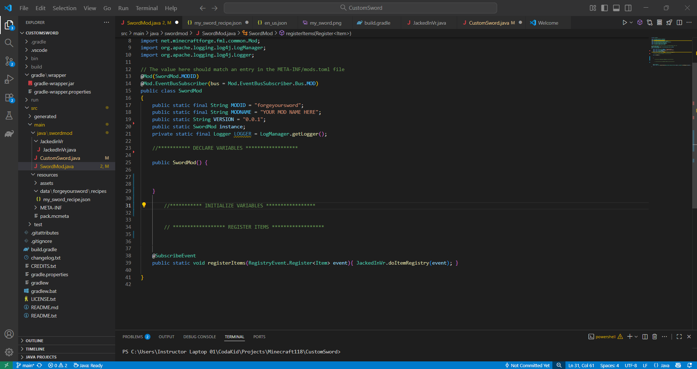

2️⃣ Declare Variables

A variable is like a special box with a name that we can store things inside.

Think of it like this:
Imagine your parents told you to clean your room. You put all your toys in a box labeled toys and said: “This box is only for toys.”

Now, whenever you want your toys, you grab the toys box, not the shoes box or the gardening box.

Variables in code work the same way. We make a box called:

mySword

We’ll use this variable to store our custom sword data. Whenever we want this sword data, we just use mySword.

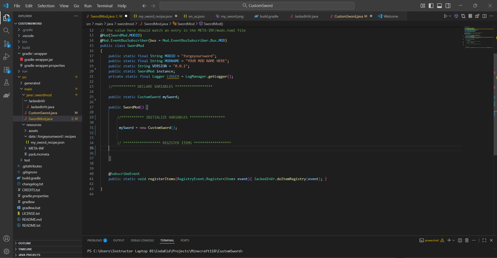

3️⃣ Create the Sword Class

Navigate to the left side of your editor and open:

CustomSword.java

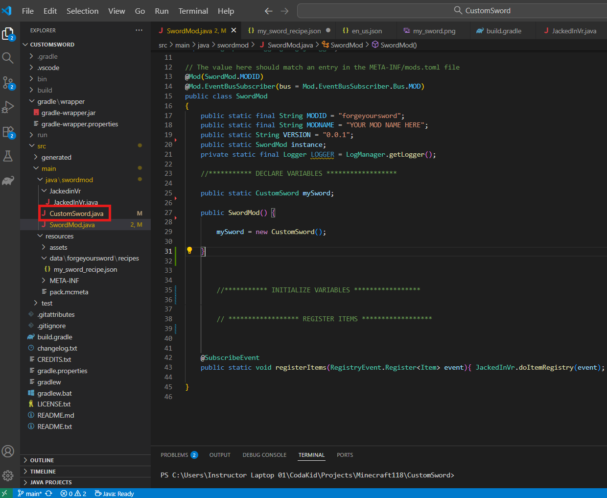

What is a Class?

In school, a class is a group of students. In programming, a class is a bundle of code that stores:

Attributes (information about something)

Functions (things it can do)

Example: A Dog class

Attributes:

Hair color

Age

Type

Coolness

Functions:

Bark

Walk

Eat

Drink

We bundle this information together into a Dog class.

Similarly, our sword will have its own class.

We'll look over the left and click on the CustomSword class

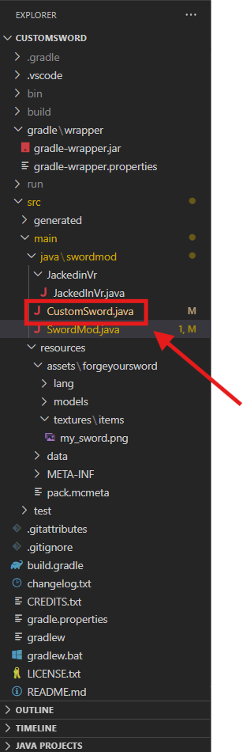

Once we click we should see this.

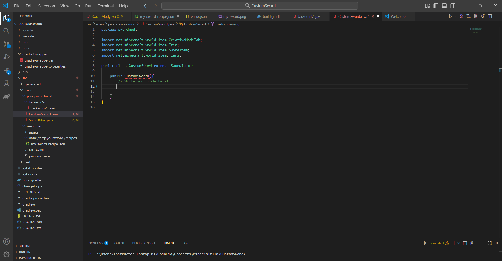

4️⃣ Define Your Sword

Now let’s define our sword class with information like name, damage, and attack speed.

public class CustomSword extends SwordItem {
    public CustomSword(Tier tier, int attackDamage, float attackSpeed, Properties properties) {
        super(tier, attackDamage, attackSpeed, properties);
    }
}

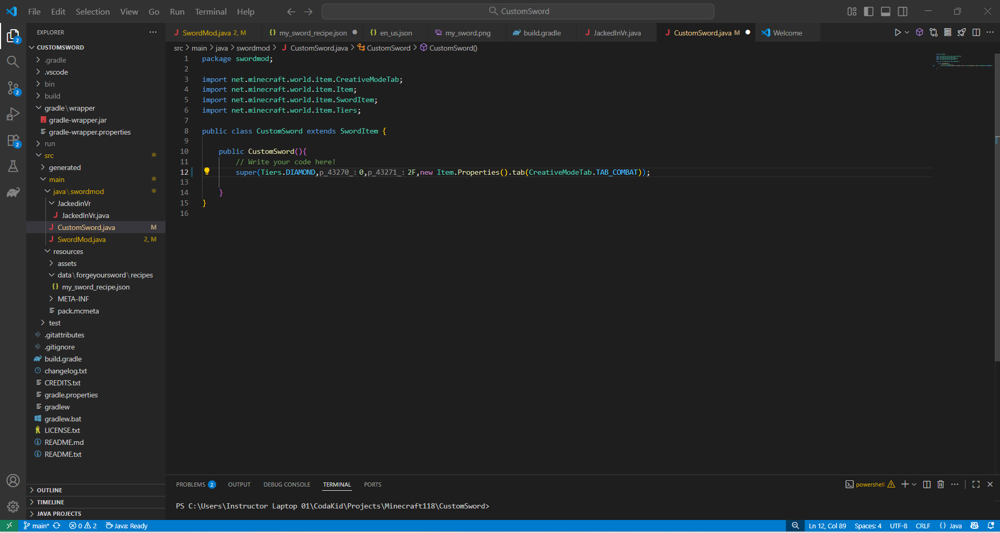

5️⃣ Register Your Sword

Before Minecraft recognizes your sword, you need to register it in SwordMod.java:

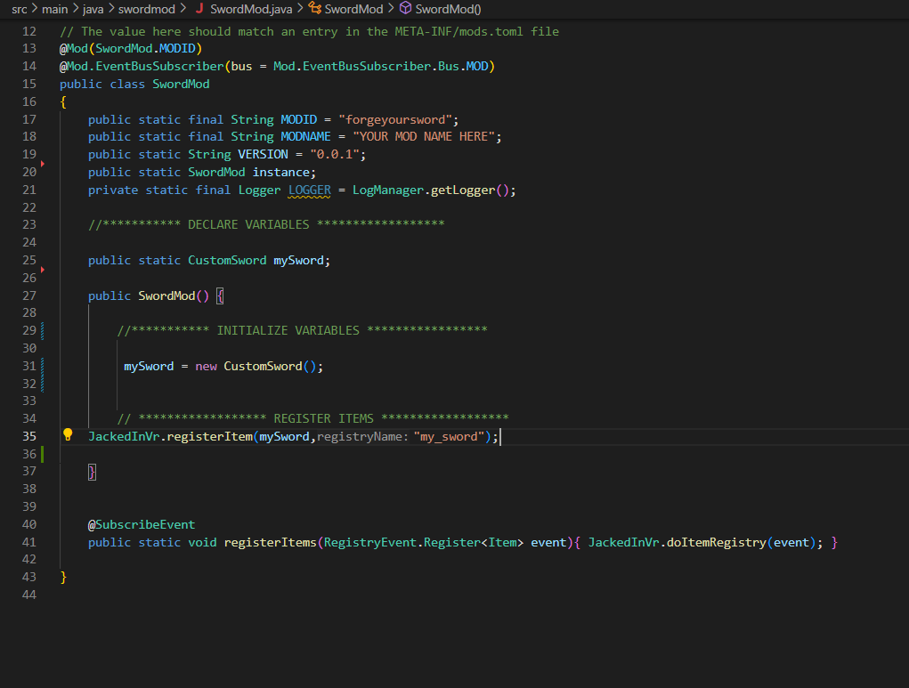

6️⃣ Test Your Sword

Click the purple cube in the top-right corner to run your code.

Open a world in Creative mode, go to the weapons tab, and you’ll find your custom sword.

It's looks plain right now. But we'll change it in a bit.

7️⃣ Customize the Sword’s Appearance

Go to:

resources -> assets -> textures -> my_sword.png

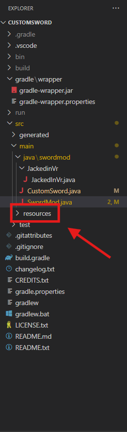 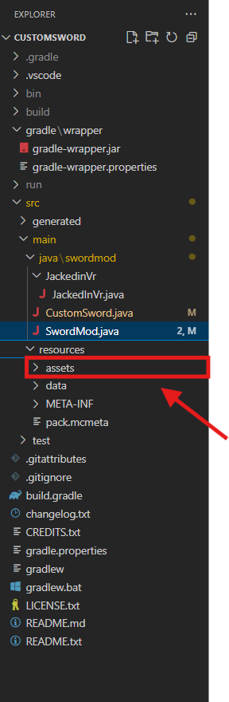 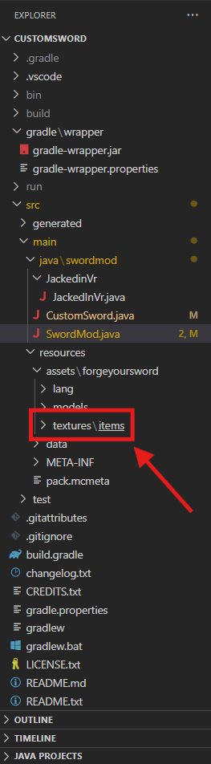 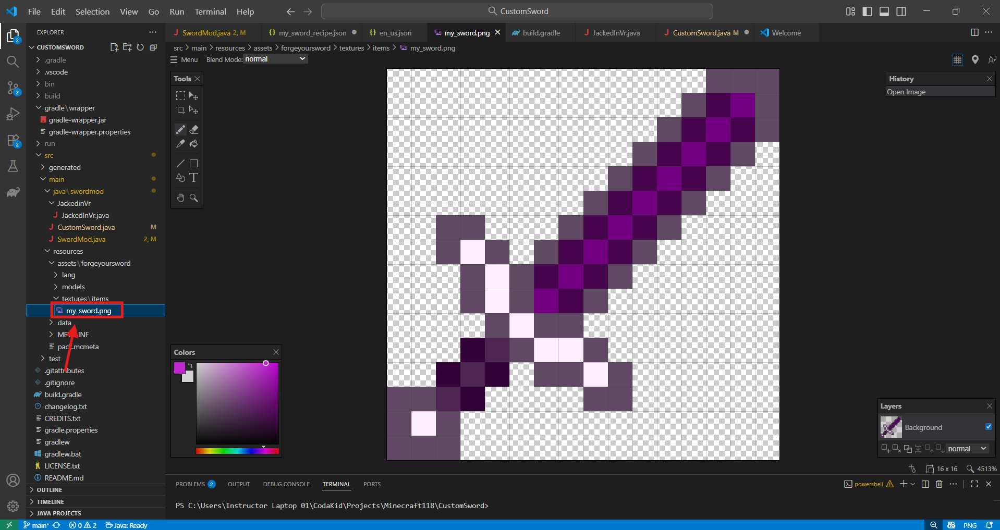 

Now you can change the sword’s color and design. Make it your own!

8️⃣ Customize Sword Traits
Create a Tier

Below your sword variable, create a new variable called myTier:

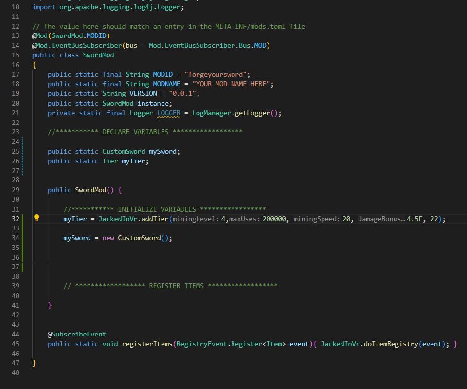

Mining Level determines what your sword can mine:

1 → Wood Pickaxe

2 → Stone Pickaxe

3 → Iron Pickaxe

4+ → Netherite Pickaxe

Max Uses: How many uses before breaking (e.g., 2000 → Netherite)

Mining Speed: How fast it mines (e.g., 12 → Gold)

Damage Bonus: Extra attack damage (e.g., 4 → Netherite)

Enchantability: How powerful enchantments can be (e.g., 22 → Gold)

Replace the original Tier.DIAMOND with myTier. Test your sword—it now has custom traits!

9️⃣ Crafting Recipe

Go to:

resources -> data -> my_sword_recipe.json

 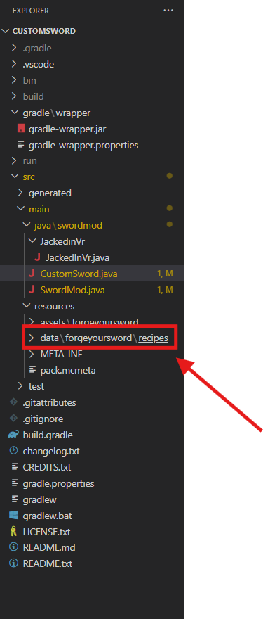 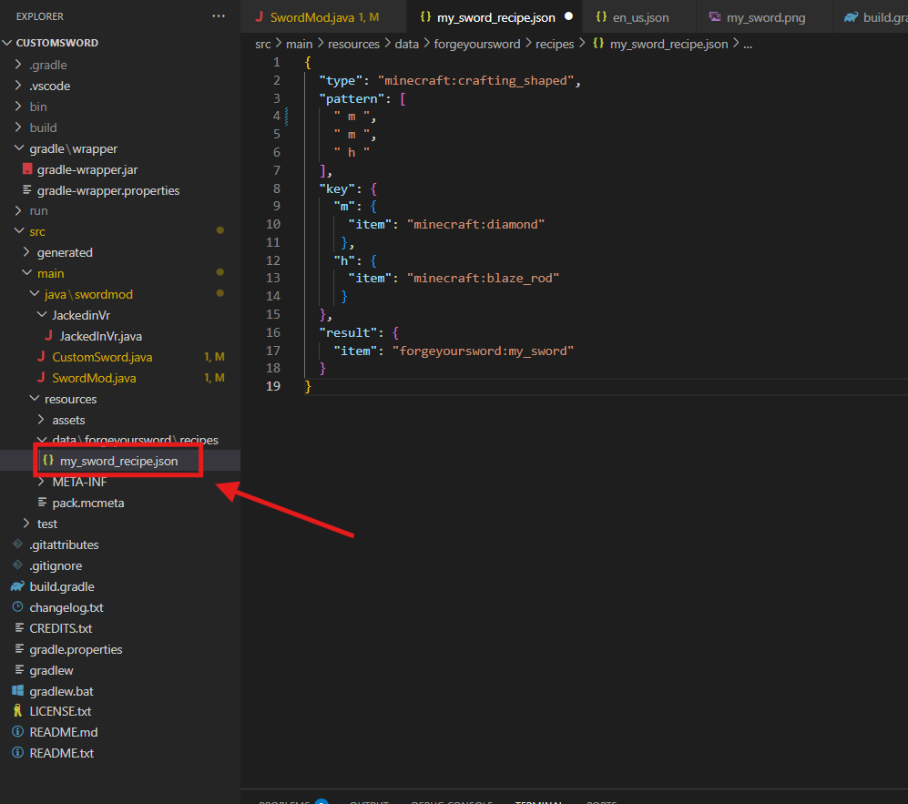

Example recipe:

{
  "type": "minecraft:crafting_shaped",
  "pattern": [
    " m ",
    " m ",
    " h "
  ],
  "key": {
    "m": {
      "item": "minecraft:diamond"
    },
    "h": {
      "item": "minecraft:stick"
    }
  },
  "result": {
    "item": "modid:my_sword",
    "count": 1
  }
}

The layout of the letters may be familiar if you've ever crafted anything in Minecraft before.

 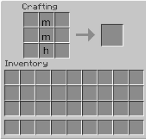

The letters in the pattern (m, h) correspond to items defined in the key section.

The pattern represents the crafting grid layout.

Below is some new items you can define if you want to really change up your crafting recipe

"minecraft:iron_ingot"
"minecraft:gold_ingot"
"minecraft:diamond"
"minecraft:emerald"
"minecraft:redstone"
"minecraft:stick"
"minecraft:string"

Now Let's Test it!!!!

🎉 Wrap Up

Now you have:

A custom sword class

A registered sword in Minecraft

A customized appearance and traits

Your own crafting recipe

Go ahead and experiment—change values, textures, and effects. Make a sword that’s truly yours!

🏆 You are officially a Minecraft Java modder now!
